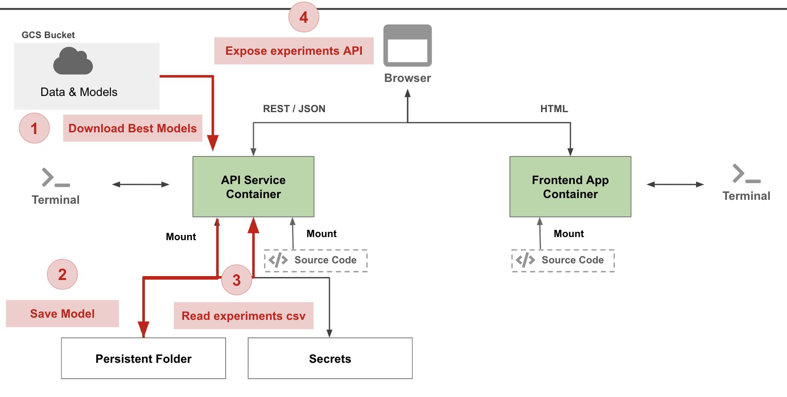
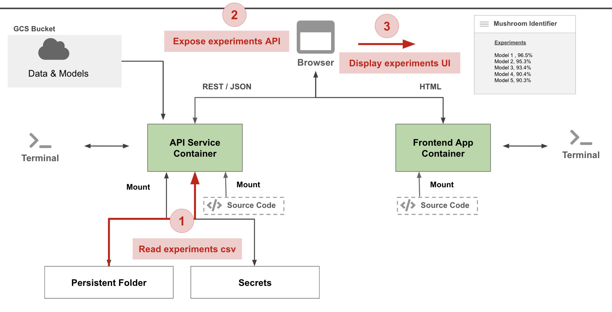

# Mushroom App - APIs & Frontend

In this tutorial we will setup three containers:
* api-service
* frontend-simple
* frontend-react


## Prerequisites
* Have Docker installed
* Have VSCode or editor of choice


## Setup Environments
In this tutorial we will setup containers to run python code for creating APIs and a container to run HTML web server.

### Clone the github repository
- Clone or download from [here](https://github.com/dlops-io/mushroom-app-v2)

### Create a local **secrets** folder

It is important to note that we do not want any secure information in Git. So we will manage these files outside of the git folder. At the same level as the `mushroom-app-v1` folder create a folder called **secrets**

Your folder structure should look like this:
```
   |-mushroom-app-v1
     |-images
     |-src
       |---api-service
       |---frontend-simple
   |-secrets
   |-persistent-folder
```

## Backend APIs
We will create a basic backend container to run our REST API. The FastAPI framework will be used for this.

The following tasks is what we will implement:


### Go into the api-service folder 
- Open a terminal and go to the location where `mushroom-app-v2/api-service`

### Build & Run Container
- Run `sh docker-shell.sh` or `docker-shell.bat` for windows

### Review docker container setup
- Review `Dockerfile` for `EXPOSE 9000`
- Review `docker-shell.sh` for `-p 9000:9000` option
- Review `docker-shell.sh` for `-e DEV=1` option
- Review `docker-entrypoint.sh` for dev mode vs production mode

### Start API Service
- To run development API service run `uvicorn_server` from the docker shell
- What is the command `uvicorn_server`?
- Test the API service by going to `http://localhost:9000/`

### Download models
We need to download model experiments data from GCS bucket
- Open `api/service.py` in your editor
- Review the service.py file
- Uncomment the following line:
```
# Start the tracker service
asyncio.create_task(tracker_service.track())
```
- Save changes and wait for the experiments to be downloaded
- Do we need to restart the API service?
- Review `api/tracker.py`
- Once experiments are dowloaded, tracker.py generate a file called `leaderboard.csv`
- Review `leaderboard.csv` opening the file using your host OS

### Build APIs
- Open `api/service.py`
- Uncomment the following line:
```
@app.get("/experiments")
def experiments_fetch():
    # Fetch experiments
    df = pd.read_csv("/persistent/experiments/experiments.csv")

    df["id"] = df.index
    df = df.fillna("")

    return df.to_dict("records")
```
- Test the API by going to `http://localhost:9000/experiments`

- Uncomment the apis `@app.get("/best_model")` and `@app.post("/predict")` to expose APIs

### View API Docs
Fast API gives us an interactive API documentation and exploration tool for free.
- Go to `http://localhost:9000/docs`
- You can test APIs from this tool

## Frontend App (Simple)
We will build a simple frontend app that uses basic HTML & Javascript. We will consume the REST APIs exposed by the api service container

The following tasks is what we will implement:


### Go into the frontend-simple folder 
- Open a terminal and go to the location where `mushroom-app-v2/frontend-simple`

### Build & Run Container
- Run `sh docker-shell.sh` or `docker-shell.bat` for windows


### Start Web Server
- To run development web server run `http-server` from the docker shell
- Go to `http://localhost:8080/experiments.html`
- If your API service is running, the page should show data from all mushroom model experiments

### Review Frontend
- Open `experiments.html`
- Review HTML & Javascript code on how APIs are called

Now we have completed the following:
* We read some data from a csv file in the persistent folder. 
* Converted the data to list of dictionary objects in **Python** 
* Exposed the results as a REST API using **FastAPI**
* Called the API to get the experiments data
* Displayed the data in a HTML table

## Model Serving
Here we will implement a model serving using:
- Self hosting our model in FastAPI
- Utilizing a deployed model on Vertex AI

### Review 
- Open `index.html`
- Review HTML & Javascript code on how model serving is called
- Review `service.py` and inspect the endpoint `/predict`
- Review `model.py`

## Frontend App (React)
Here we will use the React frontend framework to build a more robust mushroom app. The app will have multiple components and navigation.